# Firebase Functions Call Flow Diagram

## Function Call Relationships

```mermaid
graph TB
    subgraph ClientBooking["📱 Client Booking App<br/>(Public - No Auth)"]
        C1[getServices]
        C2[getAvailableTimeSlots]
        C3[sendOTPWhatsApp]
        C4[createPendingRequest]
    end

    subgraph AdminApp["🖥️ Admin Dashboard App<br/>(Auth Required)"]
        AD1[Calendar View]
        AD2[Requests View]
        AD3[Availability Management]
    end

    subgraph CloudFunctions["☁️ Cloud Functions"]
        CF1[getServices]
        CF2[getAvailableTimeSlots]
        CF3[sendOTPWhatsApp]
        CF4[verifyOTPWhatsApp]
        CF5[createPendingRequest]
        CF6[setWeeklyTemplate]
        CF7[setPlannedDate]
        CF8[checkBookingsForDate]
        CF9[checkBookingWaste]
    end

    subgraph Backend["⚙️ Backend Triggers"]
        B1[sendBookingConfirmation]
        B2[sendBookingUpdateWhatsApp]
        B3[sendBookingCancellationWhatsApp]
        B4[generateWeeklySlots]
    end

    subgraph Firestore["🗄️ Firestore Collections"]
        F1["sessions<br/>(✅ Rules: allow read: if authenticated)"]
        F2["pendingBookings<br/>(⚠️ Rules: allow read: if authenticated)"]
        F3[services]
        F4[weeklyTemplate]
        F5[plannedDates]
        F6[specialDays]
        F7[otpCodes]
    end

    subgraph Internal["🔧 Internal Functions"]
        I1[validateSlotForBooking]
        I2[getBookedTimes]
        I3[verifyOTPCode]
    end

    %% Client Booking App - ONLY through Cloud Functions
    C1 -->|"Calls"| CF1
    C2 -->|"Calls"| CF2
    C3 -->|"Calls"| CF3
    C4 -->|"Calls<br/>(includes OTP verification)"| CF5

    %% Cloud Functions read/write (Admin SDK - bypasses rules)
    CF1 -.->|"Admin SDK<br/>(Filters data)"| F3
    CF2 -.->|"Admin SDK<br/>(Filters & returns slots only)"| F4
    CF2 -.->|"Admin SDK<br/>(Filters & returns slots only)"| F5
    CF2 -.->|"Admin SDK<br/>(Filters & returns slots only)"| F6
    CF2 -.->|"Admin SDK<br/>(Reads to filter, no raw data exposed)"| F1
    CF2 -.->|"Admin SDK<br/>(Reads to filter, no raw data exposed)"| F2
    CF2 -.->|"Calls"| I2
    CF2 -.->|"Calls<br/>(for filtering)"| I1
    I2 -.->|"Admin SDK"| F1
    I2 -.->|"Admin SDK"| F2
    CF3 -.->|"Admin SDK"| F7
    CF4 -.->|"Admin SDK"| F7
    CF5 -.->|"Admin SDK<br/>(OTP verification)"| F7
    CF5 -.->|"Admin SDK<br/>(Service validation)"| F3
    CF5 -.->|"Calls<br/>(comprehensive validation)"| I1
    CF5 -.->|"Admin SDK<br/>(Create booking)"| F2
    I1 -.->|"Admin SDK<br/>(Collision check)"| F1
    I1 -.->|"Admin SDK<br/>(Collision check)"| F2
    I1 -.->|"Admin SDK<br/>(Availability check)"| F4
    I1 -.->|"Admin SDK<br/>(Availability check)"| F5
    I1 -.->|"Admin SDK<br/>(Availability check)"| F6
    CF5 -.->|"Calls<br/>(OTP verification)"| I3
    I3 -.->|"Admin SDK"| F7

    %% Admin App - Direct Firestore reads (for management)
    AD1 -->|"Direct read<br/>(onSnapshot)"| F1
    AD1 -->|"Direct read<br/>(onSnapshot)"| F2
    AD2 -->|"Direct read<br/>(onSnapshot)"| F2
    AD3 -->|"Calls"| CF6
    AD3 -->|"Calls"| CF7
    AD3 -->|"Calls"| CF8
    AD3 -->|"Calls"| CF9

    %% Admin Cloud Functions
    CF6 -.->|"Admin SDK"| F4
    CF7 -.->|"Admin SDK"| F5
    CF8 -.->|"Admin SDK"| F1
    CF8 -.->|"Admin SDK"| F2
    CF9 -.->|"Admin SDK"| F1
    CF9 -.->|"Admin SDK"| F2

    %% Backend triggers
    F1 -->|created| B1
    F1 -->|updated| B2
    F1 -->|deleted| B3
    B4 -.->|"scheduled weekly<br/>(Admin SDK)"| F4
    B4 -.->|"Admin SDK"| F5
    B4 -.->|"Admin SDK"| F6

    %% Styling
    classDef clientApp fill:#e1f5ff,stroke:#01579b,stroke-width:3px
    classDef adminApp fill:#fff3e0,stroke:#e65100,stroke-width:3px
    classDef cloudFunc fill:#e8f5e9,stroke:#2e7d32,stroke-width:2px
    classDef backendFunc fill:#f3e5f5,stroke:#4a148c,stroke-width:2px
    classDef firestore fill:#e8f5e9,stroke:#1b5e20,stroke-width:2px
    classDef firestoreWarning fill:#ffebee,stroke:#c62828,stroke-width:3px
    classDef internal fill:#fce4ec,stroke:#880e4f,stroke-width:2px

    class C1,C2,C3,C4 clientApp
    class AD1,AD2,AD3 adminApp
    class CF1,CF2,CF3,CF4,CF5,CF6,CF7,CF8,CF9 cloudFunc
    class B1,B2,B3,B4 backendFunc
    class F3,F4,F5,F6,F7 firestore
    class F1,F2 firestoreWarning
    class I1,I2,I3 internal
```



## Function Categories

### 🔵 Client Functions (Public, No Auth Required)
Called directly by client during booking process:

1. **`getServices`** - Get list of active services
2. **`getAvailableTimeSlots`** - Get available time slots for a date
3. **`sendOTPWhatsApp`** - Request OTP code via WhatsApp
4. **`verifyOTPWhatsApp`** - Verify OTP code (for general use cases)
5. **`createPendingRequest`** - Create a new pending booking request (includes OTP verification)

**Client Booking Flow:**
```
Client → getServices → Select Service
      → getAvailableTimeSlots → Select Date/Time
      → sendOTPWhatsApp → Receive Code via WhatsApp
      → createPendingRequest(code, bookingData) → OTP Verified + Booking Created (single call)
```

**Note:** `createPendingRequest` **integrates OTP verification internally**. The client:
1. Receives OTP code via WhatsApp
2. Calls `createPendingRequest` with the code and booking data
3. Function verifies OTP internally, then creates booking if valid

✅ **Security:** OTP verification is **required** and happens server-side before booking creation.

### 🟠 Admin Functions (Auth Required)
Called directly by admin users:

1. **`setWeeklyTemplate`** - Set weekly schedule template
2. **`setPlannedDate`** - Set custom slots for specific date
3. **`deletePlannedDate`** - Delete planned date
4. **`setSpecialDay`** - Block/close specific dates
5. **`deleteSpecialDay`** - Unblock dates
6. **`checkBookingsForDate`** - Check if date has bookings
7. **`checkBookingsForTimeRange`** - Check if time range has bookings
8. **`setAvailableSlots`** - Manually set available slots (legacy)
9. **`sendCustomWhatsApp`** - Send custom WhatsApp message
10. **`checkBookingWaste`** - Analyze booking waste/buffer time

### 🟣 Backend Triggers (Automatic)
Triggered automatically by Firestore events or scheduler:

1. **`sendBookingConfirmation`** - Triggered when `sessions/{sessionId}` is **created**
2. **`sendBookingUpdateWhatsApp`** - Triggered when `sessions/{sessionId}` is **updated**
3. **`sendBookingCancellationWhatsApp`** - Triggered when `sessions/{sessionId}` is **deleted**
4. **`generateWeeklySlots`** - Scheduled to run weekly (every Sunday at midnight)

### 🔴 Internal Functions
Called internally by other functions:

1. **`validateSlotForBooking`** - Shared validation service used by `getAvailableTimeSlots` and `createPendingRequest`
   - Validates time alignment with slot boundaries
   - Checks availability windows (weekly template, planned dates, special days)
   - Validates service duration fits
   - Checks for collisions (sessions + pending bookings)

## ⚠️ Security Model

### Two Different Apps with Different Access Patterns

#### 📱 Client Booking App (Public - No Authentication)
**Does NOT read directly from Firestore:**
- ✅ All access goes through Cloud Functions
- ✅ Cloud Functions use Admin SDK (bypasses security rules)
- ✅ Cloud Functions filter data server-side
- ✅ Clients only receive filtered results (e.g., available time slots)
- ✅ Clients never see raw booking data (names, phones, etc.)

**Example:** `getAvailableTimeSlots` reads from `sessions` and `pendingBookings` server-side, filters out booked slots, and returns only available time strings like `["09:00", "09:30", "10:00"]` - no client data exposed.

#### 🖥️ Admin Dashboard App (Authentication Required)
**Reads directly from Firestore:**
- ✅ Uses `onSnapshot` listeners for real-time updates
- ✅ Needs to see all booking data for management
- ✅ Reads from `sessions` and `pendingBookings` collections directly
- ⚠️ Subject to Firestore security rules

**Files:**
- `app/lib/firebase/sessions.ts` - Direct reads from `sessions` collection
- `app/lib/firebase/requests.ts` - Direct reads from `pendingBookings` collection

### Current Security Rules

**`sessions` collection:**
- `allow read: if isAuthenticated();` - **Only authenticated users can read** ✅
- `allow create/update: if isAuthenticated() && isValidBookingData()` - **Authenticated + validation** ✅
- **Note**: Currently allows any authenticated user. For stricter admin-only access, implement custom claims (TODO)

**`services` collection:**
- `allow read: if isAuthenticated();` - **Only authenticated users (admins) can read directly** ✅
- **Clients must use `getServices` Cloud Function** - filters to active services only
- **Admins can read directly** - for real-time updates in admin dashboard
- `allow create/update: if isAuthenticated() && validation` - **Authenticated + validation** ✅

**`pendingBookings` collection:**
- `allow read: if isAuthenticated();` - **Any authenticated user can read** ⚠️
- Currently allows admin app to read, but too permissive
- **Should be restricted to admin-only**

### Recommended Security Model

1. **Client Booking App:**
   - ✅ Already secure - uses Cloud Functions only
   - ✅ No direct Firestore access
   - ✅ Data filtered server-side

2. **Admin Dashboard App:**
   - ⚠️ Needs direct reads for management
   - ⚠️ Should restrict security rules to admin-only
   - **Solution:** Implement admin custom claims check in security rules

3. **Cloud Functions:**
   - ✅ Use Admin SDK (bypasses security rules - as intended)
   - ✅ Filter data server-side before returning to clients

## Data Flow Summary

### 📱 Client Booking App Process:
1. Client calls `getServices` → **Cloud Function** uses Admin SDK → Reads from `services` collection → Returns service list
2. Client calls `getAvailableTimeSlots(date, serviceDuration)` → **Cloud Function** uses Admin SDK → 
   - Reads `weeklyTemplate`, `plannedDates`, `specialDays` (availability config)
   - **Internally calls `getBookedTimes()`** which reads `sessions` and `pendingBookings` (Admin SDK)
   - Filters out booked slots server-side
   - Returns **only available time slots** (e.g., `["09:00", "09:30", "10:00"]`) - **no raw booking data**
3. Client calls `sendOTPWhatsApp(phone)` → **Cloud Function** uses Admin SDK → Writes to `otpCodes` collection → Sends OTP via WhatsApp
4. Client calls `createPendingRequest(code, bookingData)` → **Cloud Function** uses Admin SDK → 
   - **Step 1:** Verifies OTP code internally (reads from `otpCodes`, validates, deletes on success)
   - **Step 2:** If OTP valid, validates booking data (time alignment, availability windows, service fit)
   - **Step 3:** Checks for collisions using shared validation service (reads `sessions` and `pendingBookings`)
   - **Step 4:** Creates pending booking in `pendingBookings` collection
   - Returns booking ID if successful
   - **Single atomic operation** - OTP verification and booking creation happen together

**Key Points:**
- Client never sees raw booking data - Cloud Functions filter everything server-side
- OTP verification is **integrated** into `createPendingRequest` - cannot bypass
- Comprehensive validation: time alignment, availability windows, service fit, collisions
- Uses shared validation service (`slotValidationService.ts`) for consistency

### 🖥️ Admin Dashboard App Process:
- **Calendar View:** Direct Firestore reads using `onSnapshot` listeners
  - Reads from `sessions` collection (real-time updates)
  - Reads from `pendingBookings` collection (real-time updates)
  - Shows all booking details (names, phones, services, etc.)
  
- **Availability Management:** Calls Cloud Functions
  - `setWeeklyTemplate` → Updates `weeklyTemplate` collection
  - `setPlannedDate` → Updates `plannedDates` collection
  - `setSpecialDay` → Updates `specialDays` collection
  - `checkBookingsForDate` → Reads `sessions` and `pendingBookings` (via Cloud Function)

**Key Point:** Admin app needs direct reads for real-time management, but security rules should be restricted to admin-only.

### Backend Automation:
- When admin approves booking → Document created in `sessions` → Triggers `sendBookingConfirmation`
- When admin updates booking → Document updated in `sessions` → Triggers `sendBookingUpdateWhatsApp`
- When admin deletes booking → Document deleted from `sessions` → Triggers `sendBookingCancellationWhatsApp`
- Weekly scheduler → `generateWeeklySlots` → Reads `weeklyTemplate` → Writes to `availableSlots`

